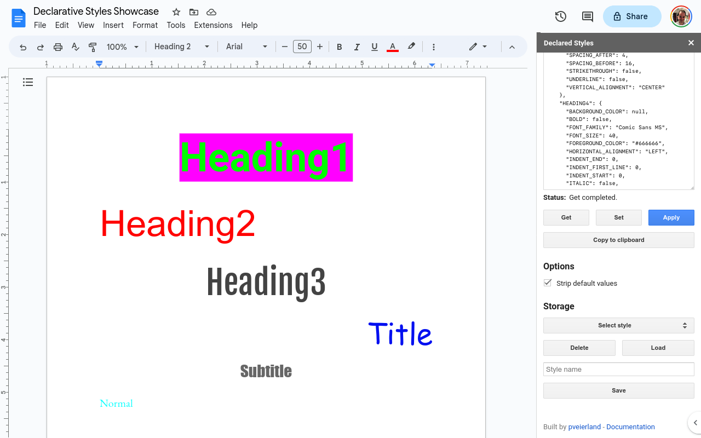
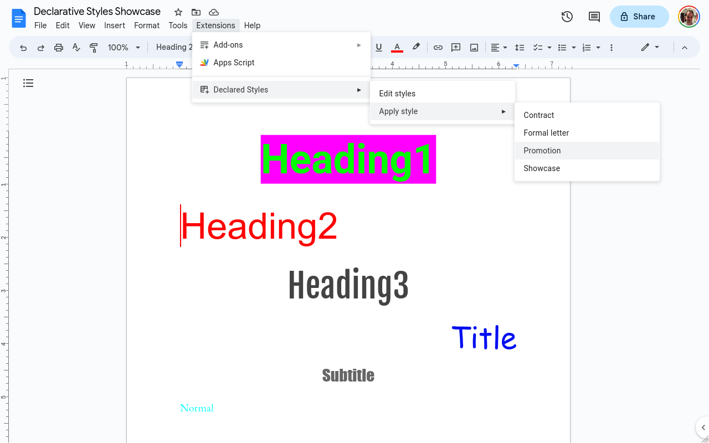

# Declared Styles

Declared Styles is a Google Docs add-on that allows you to control document styling declaratively. By default, Google Docs only allows you to store one preferred style, and does not allow editing the style information directly. This add-on allows declaring a set of styles that can be re-used across documents.

## Features

The Declared Styles add-on currently supports:

- Controlling heading styles
- Controlling page margins
- Controlling page size
- Applying styles via add-on menu
- Save/load styles from [Google Apps Script Properties storage](https://developers.google.com/apps-script/guides/properties)

NB: Note that page must be reloaded to add new styles to the apply menu, as this is only possible on page load.

## Actions

The following actions are supported inside the add-on:

- **Get**: Get document styles as JSON.
- **Set**: Set document styles from JSON.
- **Apply**: Set document styles from JSON and apply to existing elements in document.
- **Delete**: Delete selected JSON style from user storage.
- **Load**: Load selected JSON style from user storage, without setting or applying the style.
- **Save**: Save JSON style to user storage with the given name.

## Screenshots

### Editor view

### Menu view

## Attributes: `DOCUMENT`

The following attributes are supported to control document attributes:

Path

| Path                        | Type   | Example value                                                                                   | Description                                                         |
| --------------------------- | ------ | ----------------------------------------------------------------------------------------------- | ------------------------------------------------------------------- |
| `DOCUMENT.PAGE_SIZE`        | String | `"LETTER", "TABLOID", "LEGAL", "STATEMENT", "EXECUTIVE", "FOLIO", "A3", "A4", "A5", "B4", "B5"` | Used if the page size is detected.                                  |
| `DOCUMENT.PAGE_ORIENTATION` | String | `"PORTRAIT", "LANDSCAPE"`                                                                       | Used if the page size is detected.                                  |
| `DOCUMENT.PAGE_HEIGHT`      | Number |                                                                                                 | Specifies the page height in points, if `PAGE_SIZE` is not present. |
| `DOCUMENT.PAGE_WIDTH`       | Number |                                                                                                 | Specifies the page width in points, if `PAGE_SIZE` is not present.  |
| `DOCUMENT.MARGIN_BOTTOM`    | Number |                                                                                                 | Page bottom margin in points.                                       |
| `DOCUMENT.MARGIN_LEFT`      | Number |                                                                                                 | Page left margin in points.                                         |
| `DOCUMENT.MARGIN_RIGHT`     | Number |                                                                                                 | Page right margin in points.                                        |
| `DOCUMENT.MARGIN_TOP`       | Number |                                                                                                 | Page top margin in points.                                          |

## Attributes: `STYLES`

The following attributes are supported to control named styles, where `name` is `HEADING1`-`HEADING6`, `TITLE`, `SUBTITLE`, or `NORMAL`:

| Path                                 | Type    | Example values                         | Description                                   |
| ------------------------------------ | ------- | -------------------------------------- | --------------------------------------------- |
| `STYLES.<name>.BACKGROUND_COLOR`     | String  | `null, "#ff0000"`                      | The background color setting.                 |
| `STYLES.<name>.BOLD`                 | Boolean | `false, true`                          | Enable bold styling of text                   |
| `STYLES.<name>.FONT_FAMILY`          | String  | `"Arial", "Roboto"`                    | The font family setting.                      |
| `STYLES.<name>.FONT_SIZE`            | Number  | `42`                                   | The font size setting in points.              |
| `STYLES.<name>.FOREGROUND_COLOR`     | String  | `null, "#ff0000"`                      | The foreground color setting.                 |
| `STYLES.<name>.HORIZONTAL_ALIGNMENT` | String  | `"LEFT", "CENTER", "RIGHT", "JUSTIFY"` | The horizontal text alignment.                |
| `STYLES.<name>.INDENT_END`           | Number  | `0, 0.5, 1`                            | The end indentation setting in points.        |
| `STYLES.<name>.INDENT_FIRST_LINE`    | Number  | `0, 0.5, 1`                            | The first line indentation setting in points. |
| `STYLES.<name>.INDENT_START`         | Number  | `0, 0.5, 1`                            | The start indentation setting in points.      |
| `STYLES.<name>.ITALIC`               | Boolean | `false, true`                          | Enable italics styling of text.               |
| `STYLES.<name>.LINE_SPACING`         | Number  | `0, 0.5, 1`                            | The line spacing setting as a multiplier.     |
| `STYLES.<name>.SPACING_AFTER`        | Number  | `0, 0.5, 1`                            | The bottom spacing setting in points.         |
| `STYLES.<name>.SPACING_BEFORE`       | Number  | `0, 0.5, 1`                            | The top spacing setting in points.            |
| `STYLES.<name>.STRIKETHROUGH`        | Boolean | `false, true`                          | The strike-through setting.                   |
| `STYLES.<name>.UNDERLINE`            | Boolean | `false, true`                          | The underline setting.                        |
| `STYLES.<name>.VERTICAL_ALIGNMENT`   | String  | `"TOP", "CENTER", "BOTTOM"`            | The vertical alignment setting.               |

## Future work

- [ ] Support page number styling
- [ ] Support units (mm, cm, in, pt)
- [ ] Support further properties via Google Docs API
- [ ] Support import/export sets of named styles
- [ ] Consider rendering preview image of styles

## Terms of service

    1. "Declared Styles" is provided "as is" and is used at your own risk. We are not responsible for any damages or loss resulting from the use of this add-on.
    2. We reserve the right to modify or discontinue "Declared Styles" at any time without notice.
    3. We reserve the right to modify these Terms of Service without notice.
    4. By using "Declared Styles", you agree to these Terms of service.

## Privacy Policy

    1. "Declared Styles" does not collect or share any of your personal information or data with any third party.
    2. All user data and information is only stored within your Google account.
    3. We reserve the right to modify this Privacy Policy without notice.
    4. By using "Declared Styles", you agree to this Privacy Policy.

## License

## Acknowledgements

This add-on depends on the following resources:

- [lz-string](https://pieroxy.net/blog/pages/lz-string/index.html) - Text compression of style data.
